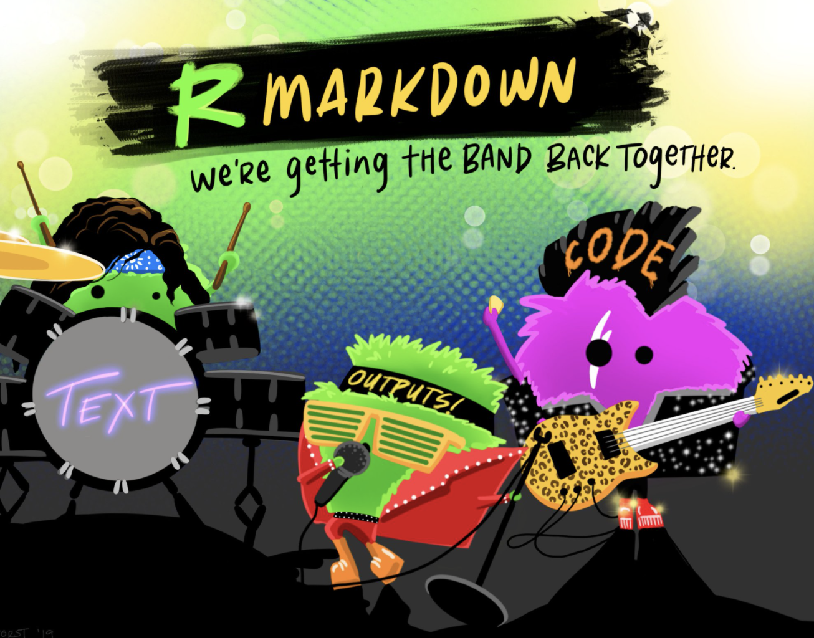

```{r setup, include=FALSE}
knitr::opts_chunk$set(echo = FALSE)
```


##Plan for today
1. Quick overview of how Rmarkdown works (Sean)
2. Syntax and code demo (Daniella)
3. Writing papers in Rmarkdown (Sean)
4. Collaborating with Rmarkdown and GitHub (Both)
5. Custom formatting w/ LaTeX templates (Sean - if time)


## R Markdown - What is it?

- Unified data science framework - combines code, its results, and your commentary

{width=500px, height=500px}

##Advantages 

**Literate Programming**: *Blend text and code to create outputs that are readible from top to bottom*

{width=500px, height=500px}


##Advantages
1. Communicating your science
2. Collaborating with other scientists (including your future self!)
3. Environment to **do** data science
4. Reproducible
5. Many different output formats (e.g., PDF, MS Word, Slide show etc.)


##How it all works

{width=500px, height=500px}

## Tools we are using
- R
- RMarkdown
- YAML
- Knitr
- Pandoc
- LaTeX


## Tools we are using
- **R**
- **RMarkdown**
- **YAML**
- Knitr
- Pandoc
- LaTeX


## Rmarkdown vs. Markdown

**Markdown (.md extension)**

- Markup language independant of R

- Plain text formatting syntax that can convert to other formats


**Rmarkdown (.Rmd extension)**


- R package (rmarkdown) that enables embedded R code to be executed in .md files

- Converts .Rmd files into many formats (**rmarkdown::render**)

##YAML 
- **Y**et **A**nother **M**arkup **L**anguage vs. YAML Ain't Markup Language?
- Metadata at the head of .Rmd files
- Determines format of the final document

##Knitr

- R package (knitr)
- Takes plain text file with embedded code, executes the code, and "knits" results back into document
- The "engine" that integrates R code into different outputs (**knitr::knit**)


##Pandoc
- Command line tool for converting documents independent from R
- Comes bundled with R Studio
- The engine for rmarkdown::render

##Process

(1) A raw .Rmd markup file (text + R code etc.)

(2) knitr::knit is called to execute code in .Rmd

(3) pandoc is called by rmarkdown::render to convert into a new output document

(4) YAML metadata passes options to guide building process and output format

{width=600px, height=100px}

##LaTeX

- Standalone software for document preparation (TeX typesetting language)

- Part of pipeline for translating .Rmd files into PDF format


##Structure
{width=700px, height=500px}


##Writing in Rmarkdown

Why?


##Project Organization and Reproducibility


Writing is in same directory as all other parts of project

Rproject

|
|

+ --- Analysis

|
|

+ --- Figures

|
|

+ --- Manuscript


##Project Organization and Reproducibility

Version Control with Git and GitHub

{width=650px, height=450px}

##Control of Formatting
{width=500px, height=300px}

Less time cursing at MS Word


##Looks Nice
{width=450px, height=500px}


##General Advice

**Knit early and often!!**

